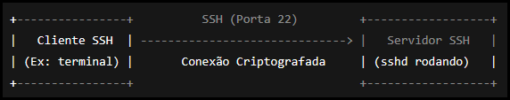
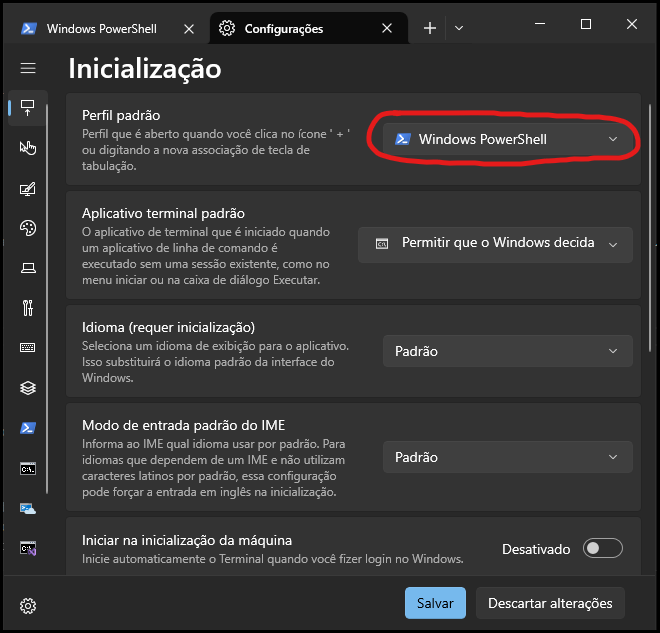
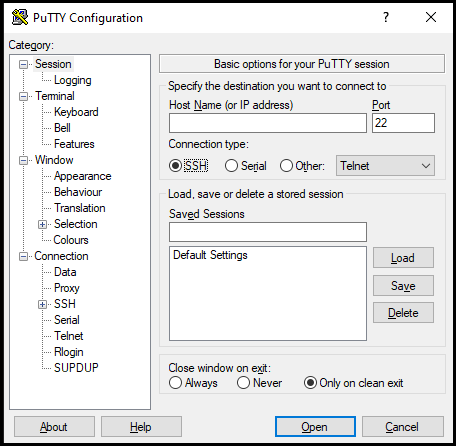
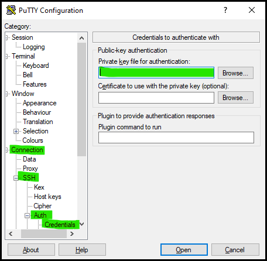

# Como usar um cliente SSH

Este guia explica, de forma prática e acessível, como você pode se conectar a um servidor remoto usando um cliente SSH.


## O que é SSH?

  
SSH (Secure Shell) é um protocolo que permite acessar outro computador de maneira segura através da rede. É muito usado para administrar servidores Linux ou acessar máquinas remotas.

Para utilizar o SSH, você precisa de:

- Um cliente SSH instalado no seu computador, o OpenSSH já vem no Linux e no macOS;
  - No Windows você pode usar o [PuTTY](#como-se-conectar-usando-o-putty-windows) ou [PowerShell (via aplicativo Terminal)](#como-se-conectar-usando-o-terminal-windows).
- O endereço IP ou o nome do servidor
- A porta de conexão
- Um nome de usuário válido
- Uma senha ou uma [chave SSH configurada](#usando-autenticação-por-chave-ssh)

---

## Como se conectar via terminal (Linux, macOS ou Windows PowerShell)

Se estiver usando Linux, macOS ou o PowerShell no Windows, o processo é simples. Abra o terminal e digite o comando:

```bash
ssh usuario@ip_do_servidor
```

Substitua `usuario` pelo seu nome de usuário no servidor e `ip_do_servidor` pelo endereço IP ou hostname.

**Exemplo:**

```bash
ssh joao@192.168.1.100
```

Na primeira vez que se conectar, o sistema vai perguntar se você confia no servidor. Digite `yes` e pressione Enter. Depois disso, você precisará digitar sua senha.

---

## Como se conectar usando o Terminal (Windows)


- No menu iniciar digite `terminal`.
  - Caso nao tenha instalado siga as [instruções aqui](https://learn.microsoft.com/pt-br/windows/terminal/install).
- Certifique-se que está utilizando o PowerShell como perfil padrão. (exemplo abaixo)

- Digite o comando abaixo:
  - `ssh usuario@ip_do_servidor`
  - Substitua `usuario` e `ip_do_servidor` pelas credenciais fornecidas.

Relacionados:  
> [Acessando com chave no terminal](#31-acessando-com-chave-no-terminal-windows)

## Como se conectar usando o PuTTY (Windows)

Para quem prefere uma interface gráfica no Windows, o PuTTY é uma boa opção.
> Tela inicial do PuTTY (v0.83)  
[](https://www.putty.org/)

1. Baixe o [PuTTY](https://www.putty.org/) no site oficial.
2. Instale e abra o programa.
3. Na tela inicial, insira o endereço IP, dominio ou hostname do servidor no campo **Host Name (or IP address)**.
4. Preencha o campo **Port** de acordo com as credenciais fornecidas, por padrão a porta é `22` porém pode ser alterada.  
5. Certifique-se que o **Connection type** esteja com a opção SSH selecionada.
6. Clique em **Open**.
7. Uma janela de terminal será aberta, onde você deverá digitar seu nome de usuário e sua senha.  

Obs: Caso utilize [chave SSH](#usando-autenticação-por-chave-ssh) o passo 7 não será necessário.
Obs2: Para agilizar e facilitar pode salvar a sessão (**Session**) com o nome do seu servidor

Relacionados:  
> [Acessando com chave no PuTTY (Windows)](#32-acessando-com-chave-no-putty-windows)

---

## Usando autenticação por chave SSH

Alguns servidores preferem (ou exigem) autenticação por chave SSH em vez de senha. Para isso, você precisa gerar um par de chaves no seu computador.

#### 1. Gerar a chave:

   No terminal, digite:

   ```bash
   ssh-keygen -t rsa -b 4096 -C "seu_email@exemplo.com"
   ```

   Pressione Enter para aceitar os caminhos padrão. Uma chave pública e uma chave privada serão criadas.

#### 2. Enviar a chave pública para o servidor via terminal:

   Use o comando:

   ```bash
   ssh-copy-id usuario@ip_do_servidor
   ```

#### 3. Agora você pode acessar o servidor sem precisar digitar a senha:

   ```bash
   ssh usuario@ip_do_servidor
   ```

#### 3.1. Acessando com chave no terminal (Windows)

   > METODO 1: Importe a chave:  
   - copie sua chave para o local padrão do windows
     - `c:/SEU_USUARIO/.ssh/`
   - abra o arquivo `config` nesta mesma pasta com algum editor de textos (ex: bloco de notas, sublime text, notepad++, etc)
     - no arquivo encontre o ip do seu servidor, exemplo abaixo:
     ```
     Host IP_OU_DOMINO_DO_SERVIDOR
     HostName IP_OU_DOMINO_DO_SERVIDOR
     User USUARIO
     ```
     - adicione a seguinte linha logo abaixo da linha de usuario:
     ```
     IdentityFile ~/.ssh/NOME_DA_CHAVE
     ```
     - Salve o arquivo e teste a conexao com o comando a seguir:
     ```bash
     ssh usuario@ip_do_servidor
     ```
   - Se a conexao nao solicitou a senha e obteve acesso o processo esta completo e para acessar é só utilizar o mesmo comando acima.

   > METODO 2:  Especifique a chave diretamente no comando:  
   ```bash
   ssh -i chave_SSH_com_endereco_completo usuario@ip_do_servidor
   ```
   exemplo:
   ```bash
   ssh -i c:/pasta1/minhachavessh usuario@ip_do_servidor
   ```

#### 3.2. Acessando com chave no PuTTY (Windows)
   
   - No tela inical do PuTTY salve um perfil pra facilitar.
   - Na lateral esquerda vá em:
     - Conection -> SSH -> Auth -> Credentials  
     [](#32-acessando-com-chave-no-putty-windows)
   - Na seção de private keys selecione a sua.
   - Volte para a aba `Session` e salve novamente seu perfil, caso contrario precisará inserir a chave sempre que abrir o PuTTY.
   - Ao abrir é só clicar duas vezes no perfil salvo que ele iniciará a conexão.

---

## Possíveis problemas e como resolver

- **Connection refused**: verifique se o serviço SSH está ativo no servidor e se a porta fornecida junto as credenciais (por padrão `22`) está aberta no firewall.
- **Permission denied**: confirme se o nome de usuário, a senha ou as permissões da chave SSH estão corretos.
- **Timeout ou sem resposta**: cheque a conexão de rede e o endereço IP/hostname.

Caso continue com dificuldades, entre em contato com o administrador do sistema ou consulte a [documentação oficial do OpenSSH](https://www.openssh.com/manual.html).

---

## Conclusão

Com estas instruções, você já está apto a acessar servidores remotos de forma segura utilizando um cliente SSH, seja pelo terminal ou usando uma interface gráfica como o PuTTY. O SSH é uma ferramenta essencial para administradores de sistemas e desenvolvedores, garantindo acesso rápido e seguro aos ambientes de trabalho remotos.
